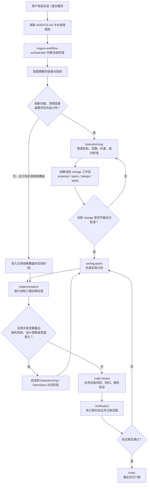

# super-spec-cli

一个以官方 OpenSpec 为正式规格底座、以 Superpowers 为执行纪律、以仓库级治理规则和自动化门禁为扩展约束的 AI 开发脚手架。

它解决的不是“如何尽快生成一段代码”，而是“如何让 AI 把一次需求对话稳定推进成一条可审计、可回滚、可验证的完整交付链路”。

## 快速入口

- 非开发用户操作指南：[process-user-guide.md](./process-user-guide.md)
- 主流程说明：[process-main.md](./process-main.md)

## 项目定位

本仓库主要用来约束以下高频问题：

- AI 跳过规格，直接进入计划和编码。
- 规格、计划、实现、评审、验证不够明确，导致阶段职责混乱，需求实现偏移。
- 代码先生成，文档后补齐，形成伪闭环。
- 即使功能能跑通，也可能违背公司组件规范、流程门禁或环境前置条件。
- 跨会话继续工作时无法快速恢复当前阶段、阻塞项和下一步动作。

因此，本仓库把“交付完成”定义为完整闭环，而不是只产出代码目录：

`对话意图 -> OpenSpec change -> 实现计划 -> 实现 -> 评审 -> 验证 -> finish`

## 先记住的三件事

### 1. `AGENTS.md` 是唯一宪法

仓库级硬规则只以 [AGENTS.md](AGENTS.md) 为准，包括：

- 强制阶段顺序
- 必须调用的技能
- 必须读取的 lane 规范
- 独立子 Agent 要求
- 阶段门禁、回滚规则与完成门禁

### 2. `openspec/` 是唯一正式规格入口

所有新功能、流程变更、行为变更的正式规格只允许写入：

- `openspec/changes/<change-id>/proposal.md`
- `openspec/changes/<change-id>/design.md`
- `openspec/changes/<change-id>/tasks.md`
- `openspec/changes/<change-id>/specs/...`
- `openspec/specs/...`

这部分回答的是：

- 为什么要做
- 要做什么
- 哪些行为必须发生
- 哪些边界必须被覆盖

### 3. `docs/superpowers/` 是正式执行证据层

`docs/superpowers/` 用于保存执行过程中的正式产物，而不是正式规格：

- `docs/superpowers/specs/`：brainstorming 产出的设计辅助文档，只能作为背景输入，不替代 OpenSpec
- `docs/superpowers/plans/`：实现计划
- `docs/superpowers/reviews/`：计划审查、代码评审、验证记录
- `docs/superpowers/visuals/`：可视化原型、流程图、辅助材料

这部分回答的是：

- 如何实现
- 如何评审
- 如何验证

## 正式目录与运行时目录的边界

仓库里有四类容易混淆的目录，边界如下：

| 类型 | 目录 | 作用 | 是否正式产物 |
| --- | --- | --- | --- |
| 宪法层 | `AGENTS.md` | 定义仓库级硬规则、门禁和回滚原则 | 是 |
| 规格层 | `openspec/` | 定义正式需求、设计、任务与长期 capability specs | 是 |
| 执行证据层 | `docs/superpowers/` | 定义设计辅助、实现计划、评审与验证记录 | 是 |
| 运行时目录 | `.superpowers/` | brainstorming 可视化会话、临时页面、状态缓存等运行时文件 | 否 |

重点：

- `openspec/` 是正式规格真源。
- `docs/superpowers/` 是正式执行证据目录。
- `.superpowers/` 不应承载需要长期审计的正式文档。

## 从对话到交付的整体流程



## 工作流职责总览

### OpenSpec 与 Superpowers 的关系

| 体系 | 负责内容 | 典型输入 | 典型输出 | 正式落点 |
| --- | --- | --- | --- | --- |
| OpenSpec | 定义“为什么做、要做什么、行为怎么变” | 用户需求、brainstorming 结论、现有能力规格 | proposal、design、tasks、spec delta、长期 specs | `openspec/changes/<change-id>/...`、`openspec/specs/...` |
| Superpowers | 定义“按什么纪律推进、如何实现、如何评审、如何验证” | 已批准的 OpenSpec change、仓库技能、现有代码、工程规范 | 设计辅助文档、实现计划、评审记录、验证记录、可视化材料 | `docs/superpowers/...` |

### 仓库技能的职责边界

| 技能 / 规则入口 | 职责 |
| --- | --- |
| `magus-workflow-orchestrator` | 工作流路由与技能装配 |
| `magus-workflow-governance` | OpenSpec 产物职责边界与更新判断 |
| `magus-base-standards` | 工程质量、评审写法、验证证据等通用质量基线 |
| `mg-frontend-vue-guide` | Vue 前端项目规范、目录划分、代码风格和实现约定 |
| `mg-framework-ui` | Magustek 企业级组件库能力边界与替换规则 |
| `docs/agents/frontend/AGENTS.md` | 前端 lane 的阶段策略 |
| `docs/agents/backend/AGENTS.md` | 后端 lane 的阶段策略 |
| `docs/agents/test/AGENTS.md` | 前端测试策略、预算、验证分层与 E2E 准入规则 |

## 阶段职责总览

| 阶段 | 回答的问题 | 主要输出 | 正式落点 |
| --- | --- | --- | --- |
| `brainstorming` | 需求到底是什么，边界和成功标准是什么 | 澄清结论、设计辅助文档 | 会话结论，必要时写入 `docs/superpowers/specs/` |
| `proposal` | 为什么做这次 change，范围和非目标是什么 | 变更动机与范围声明 | `openspec/changes/<change-id>/proposal.md` |
| `specs` | 系统必须满足哪些行为要求 | 规格差异文档 | `openspec/changes/<change-id>/specs/...` |
| `design` | 采用什么设计、如何处理边界、风险和迁移 | 技术设计 | `openspec/changes/<change-id>/design.md` |
| `tasks` | 具体有哪些可执行任务、顺序和验收项 | 任务清单 | `openspec/changes/<change-id>/tasks.md` |
| `writing-plans` | 具体怎么实现 | 实现计划、测试分层方案、验证路径 | `docs/superpowers/plans/*.md` |
| `implementation` | 按计划实现代码和测试 | 代码、测试、必要文档更新、readiness 记录 | 代码仓库本体 + `openspec/changes/<change-id>/process/` |
| `code-review` | 当前实现有哪些风险、回归和缺失验证 | 评审结论、风险列表、建议动作 | `docs/superpowers/reviews/*review*.md` |
| `verification` | 真正执行了什么、结果是否满足门禁 | 验证记录、剩余风险、阶段结论 | `docs/superpowers/reviews/*verification*.md` |
| `finish` | 当前 change 是否具备交付条件 | 交付结论与剩余风险说明 | 当前 change 完整闭环产物 |

## Lane 与当前代码形态

当前仓库同时存在“治理 lane”和“代码工作区”两个视角，不要混淆。

### 正式治理 lane

| lane | 适用内容 | 规则入口 |
| --- | --- | --- |
| `frontend` | Vue 页面、组件、布局、交互与前端测试 | `docs/agents/frontend/AGENTS.md`、`docs/agents/test/AGENTS.md` |
| `backend-java` | 已有 `Java/Spring` 业务模块的接口、契约、异常、测试与评审 | `docs/agents/backend/AGENTS.md` |

说明：

- `backend-java` 是当前仓库已经制度化的后端治理 lane。
- 非 `Java/Spring` 技术栈目前没有正式 lane 规则，只保留扩展占位。

### 当前代码工作区

| 路径 | 当前形态 | 说明 |
| --- | --- | --- |
| `packages/frontend-vue/` | Vue 3 + Vite + TypeScript 前端工作区 | 当前主要前端实现区域 |
| `packages/backend-node/` | Nuxt 4 + Vue 的 Node 工作区 | 名称保留为 `backend-node`，但不等同于 `backend-java` lane 的正式治理参考 |

重点提醒：

- 当前仓库**没有** `packages/backend-java/` 工作区。
- 因此，README 不再声称仓库内存在活跃的 `packages/backend-java/` 目录。
- 如果未来接入真实 `Java/Spring` 工程，再补充对应工作区和更具体的阅读指引。

## 自动化脚本与门禁

仓库不只靠口头规则，还提供脚本把门禁变成可执行检查。

| 脚本 | 作用 |
| --- | --- |
| `scripts/scaffold-change-process.mjs` | 为新 change 生成 `workflow-state.md` 与 `implementation-readiness.md` |
| `scripts/check-workflow.mjs` | 校验当前 change 是否满足阶段门禁和关键路径完整性 |
| `scripts/check-frontend-conventions.mjs` | 校验前端 lane 是否违反组件与页面实现约束 |
| `scripts/check-backend-conventions.mjs` | 校验 `backend-java` lane 的基线约束 |
| `scripts/fix-esbuild-permissions.mjs` | 修复 Windows 下 Vite / Vitest / Playwright 常见权限问题 |

详细说明见 [scripts/README.md](scripts/README.md)。

## 关键目录与职责

| 路径 | 职责 | 状态 |
| --- | --- | --- |
| `AGENTS.md` | 仓库级工作流宪法 | 活跃 |
| `.agents/skills/` | 仓库技能定义 | 活跃 |
| `docs/agents/frontend/` | 前端 lane 规则入口 | 活跃 |
| `docs/agents/backend/` | `backend-java` lane 规则入口 | 活跃 |
| `docs/agents/test/` | 前端测试规则入口 | 活跃 |
| `openspec/changes/` | 当前 change 的正式规格工作区 | 活跃 |
| `openspec/specs/` | 长期 capability specs | 活跃 |
| `openspec/config.yaml` | OpenSpec 工具配置与目录边界说明 | 活跃 |
| `openspec/changes/<change-id>/process/` | 当前 change 的运行态记录 | 活跃 |
| `docs/superpowers/specs/` | Superpowers brainstorming 设计辅助文档 | 辅助 |
| `docs/superpowers/plans/` | 正式实现计划 | 活跃 |
| `docs/superpowers/reviews/` | 独立评审与验证记录 | 活跃 |
| `docs/superpowers/visuals/` | 原型、流程图与可视化辅助材料 | 活跃 |
| `.superpowers/` | brainstorming 可视化运行时目录 | 运行时 |
| `docs/process/` | 稳定流程定义、子 Agent 指南、阶段检查清单 | 活跃 |
| `docs/other/` | 路径索引、专题说明、辅助文档 | 辅助 |
| `scripts/` | 门禁脚本与脚手架脚本 | 活跃 |
| `tempaltes/` | `implementation-readiness` 模板目录，当前沿用仓库现有命名 | 活跃 |
| `packages/frontend-vue/` | Vue 前端工作区 | 活跃 |
| `packages/backend-node/` | Node / Nuxt 工作区 | 活跃 |

## 常见误区

### 1. `docs/superpowers/specs/` 不是正式 OpenSpec

这里的文档是 Superpowers brainstorming 的设计辅助输出，可作为背景材料，但不能替代 `openspec/` 下的正式规格。

### 2. `packages/backend-node/` 不是 `backend-java` lane

`backend-node` 是现有代码工作区名称，不代表它自动成为后端治理规则的正式参考来源。当前正式后端 lane 仍然是 `backend-java`。

### 3. `.superpowers/` 不是正式文档目录

它更适合保存 brainstorming 运行时页面、临时状态和本地会话资料，不应该作为评审、计划或正式规格的长期落点。

### 4. review / verification 不能反向替代规格批准

评审和验证只能说明“是否按已批准内容完成”，不能倒推“因为实现能跑通，所以规格默认成立”。

## 推荐阅读顺序

如果你第一次接触这个仓库，建议按下面顺序阅读：

1. [docs/other/PATH-GUIDE.md](docs/other/PATH-GUIDE.md)
2. [AGENTS.md](AGENTS.md)
3. [openspec/config.yaml](openspec/config.yaml)
4. `openspec/changes/<change-id>/`
5. `openspec/specs/`
6. `openspec/changes/<change-id>/process/`
7. `docs/superpowers/plans/` 与 `docs/superpowers/reviews/`
8. 按 lane 读取：
   - [docs/agents/frontend/AGENTS.md](docs/agents/frontend/AGENTS.md)
   - [docs/agents/backend/AGENTS.md](docs/agents/backend/AGENTS.md)
   - [docs/agents/test/AGENTS.md](docs/agents/test/AGENTS.md)
9. [scripts/README.md](scripts/README.md)

## 快速上手

### 新建一个 change

```bash
node scripts/scaffold-change-process.mjs --change "<change-id>" --stage proposal
```

如果当前 change 不是纯前端，应显式声明 lane，例如：

```bash
node scripts/scaffold-change-process.mjs --change "<change-id>" --stage proposal --lanes backend-java
```

### 在推进阶段前检查门禁

```bash
node scripts/check-workflow.mjs --change "<change-id>"
```

### 在前端验证前检查前端规范

```bash
node scripts/check-frontend-conventions.mjs --change "<change-id>"
```

### 在 `backend-java` lane 验证前检查后端规范

```bash
node scripts/check-backend-conventions.mjs --change "<change-id>"
```

## 总结

`super-spec-cli` 的本质不是一个“快速生成页面”的模板仓库，而是一个把 AI 开发行为制度化、证据化的工作流脚手架。

它要求：

- 正式规格写在 `openspec/`
- 执行证据写在 `docs/superpowers/`
- 运行时资料留在 `.superpowers/`
- 硬规则统一以 `AGENTS.md` 为准

只要把这四层边界守住，这个仓库就能在多轮对话、多角色协作和复杂变更下保持稳定。
