# AI 开发工作流主流程说明

## 1. 文档目的

本文档用于说明当前仓库的主工作流，回答三个核心问题：

1. 整个流程按什么顺序推进。
2. 每个阶段要产出什么正式文档。
3. 什么情况下可以进入下一阶段，什么情况下必须回滚。

本文档是对仓库现有规则的归纳说明，便于开发者快速理解流程。正式门禁仍以仓库根目录 `AGENTS.md` 与当前 `change-id` 下的 OpenSpec 产物为准。

## 2. 一句话总览

本仓库采用严格的阶段门禁工作流：

`需求输入 -> brainstorming -> proposal -> specs -> design -> tasks -> writing-plans -> implementation -> code-review -> verification -> finish`

其中：

- `docs/requirements/*.md` 或沟通整理文档是上游输入，不是最终唯一事实来源。
- `openspec/changes/<change-id>/` 下的 OpenSpec 套件才是当前变更的正式事实来源。
- `docs/superpowers/plans/`、`docs/superpowers/reviews/`、`docs/superpowers/visuals/` 属于辅助交付材料，不能替代正式规格。

## 3. 主流程图

```mermaid
flowchart TD
    A["开始：收到需求、PRD 或沟通结论"] --> B["识别本次 change 的目标、范围、约束、成功标准"]
    B --> C{"是否引入新行为、存在歧义、或不再是微小调整？"}
    C -- "是" --> D["进入 brainstorming<br/>澄清边界、约束、成功标准"]
    C -- "否" --> D

    D --> E["创建工作区<br/>openspec/changes/&lt;change-id&gt;/"]
    E --> F["执行脚本<br/>node scripts/scaffold-change-process.mjs --change &lt;change-id&gt; --stage proposal"]
    F --> G["生成 process 模板<br/>workflow-state.md / implementation-readiness.md"]

    G --> H["编写 proposal.md<br/>说明为什么做、做什么、影响范围、非目标"]
    H --> I["编写 specs/.../spec.md<br/>定义系统必须做什么与场景"]
    I --> J["编写 design.md<br/>定义模块划分、关键决策、风险、迁移方案"]
    J --> K["编写 tasks.md<br/>拆解任务、阶段门禁、范围和质量项"]
    K --> L["同步 process 运行态<br/>更新 workflow-state.md / implementation-readiness.md"]

    L --> M["独立 Plan/Review Agent 审查 OpenSpec 套件"]
    M --> N{"规格审查是否通过？"}
    N -- "否" --> D
    N -- "是" --> O["用户确认规格审查结论"]
    O --> P{"用户是否允许进入 writing-plans？"}
    P -- "否" --> D
    P -- "是" --> Q["writing-plans<br/>在 docs/superpowers/plans/ 编写正式实现计划"]

    Q --> R["补齐计划内容<br/>文件范围、测试矩阵、验证命令、lane 拆分"]
    R --> S["补齐 implementation-readiness.md<br/>确认环境、边界、测试与风险口径"]
    S --> T["独立 Plan/Review Agent 审查计划与 readiness"]
    T --> U{"计划与 readiness 是否通过？"}
    U -- "否" --> Q
    U -- "是" --> V["用户确认允许进入 implementation"]
    V --> W{"用户是否确认？"}
    W -- "否" --> Q
    W -- "是" --> X["implementation 前准备<br/>加载必需技能与 lane 规则"]

    X --> Y["按 TDD 实现<br/>先失败用例，再写正式实现"]
    Y --> Z["完成一个可独立验证单元后<br/>同步 workflow-state.md"]
    Z --> AA{"编码中是否出现需求漂移、临时发明规则、设计无法支撑？"}
    AA -- "是" --> D
    AA -- "否" --> AB{"代码、测试、相关文档是否已完成？"}
    AB -- "否" --> Y
    AB -- "是" --> AC["形成独立 code-review 记录<br/>落盘 docs/superpowers/reviews/"]

    AC --> AD{"code-review 是否通过？"}
    AD -- "否" --> Y
    AD -- "是" --> AE["进入 verification<br/>启用独立 Verification Agent"]
    AE --> AF["执行真实命令、记录真实输出、进行对抗式探测"]
    AF --> AG["补齐 verification 记录<br/>落盘 docs/superpowers/reviews/"]
    AG --> AH{"verification 是否通过？"}
    AH -- "否" --> Y
    AH -- "是" --> AI["记录剩余风险、覆盖缺口、需求漂移判断"]
    AI --> AJ["用户确认是否接受当前验证结论与剩余风险"]
    AJ --> AK{"用户是否接受？"}
    AK -- "否" --> Y
    AK -- "是" --> AL["finish<br/>宣布当前 change 完成"]
```

## 4. 分阶段说明

| 阶段 | 目标 | 核心产物 | 进入条件 | 退出条件 |
| --- | --- | --- | --- | --- |
| `brainstorming` | 澄清范围、边界、约束、成功标准 | 沟通结论、边界澄清 | 引入新行为、存在歧义、规格不足时必须进入 | 目标和边界清楚，不再需要编码时临时发明规则 |
| `proposal` | 冻结本期变更意图与边界 | `proposal.md` | 已创建 current change 工作区 | 明确 why / what / impact / out of scope |
| `specs` | 定义系统必须做什么 | `specs/.../spec.md` | proposal 已具备 | 关键需求、场景、边界、异常路径写清 |
| `design` | 定义实现方案与结构决策 | `design.md` | specs 已具备 | 模块划分、关键决策、风险和迁移方案清楚 |
| `tasks` | 拆成正式可执行任务 | `tasks.md` | design 已具备 | 任务边界、阶段门禁、质量项清楚 |
| `writing-plans` | 写实现计划而不是重写规格 | `docs/superpowers/plans/*.md` | OpenSpec 套件齐备，独立审查通过，用户确认 | 计划明确文件、测试、命令、lane 和顺序 |
| `implementation` | 按计划执行代码与测试实现 | 代码、测试、流程状态同步 | readiness 完成，计划审查通过，用户确认 | 代码、测试、文档变更全部完成 |
| `code-review` | 独立评审实现、规范与测试覆盖 | `docs/superpowers/reviews/*-code-review.md` | 实现已完成 | 给出结构化结论，决定是否允许进入 verification |
| `verification` | 用真实命令和真实输出做最终验证 | `docs/superpowers/reviews/*-verification.md` | 独立 code review 已完成 | 给出结构化验证结论，并等待用户确认 |
| `finish` | 正式收尾 | 同步后的流程状态与最终结论 | verification 完成且用户接受结论 | 当前 change 可被声明完成 |

## 5. 正式产物与辅助产物

### 5.1 上游输入产物

这类文档用于提供背景，不是正式唯一事实来源：

- `docs/requirements/*.md`
- 与用户沟通后整理的需求文档
- 会议纪要、聊天结论、补充说明

### 5.2 正式规格产物

这类文档位于 `openspec/changes/<change-id>/`，是当前变更的正式事实来源：

| 产物 | 路径 | 作用 |
| --- | --- | --- |
| Proposal | `openspec/changes/<change-id>/proposal.md` | 说明为什么做、做什么、影响和非目标 |
| Spec | `openspec/changes/<change-id>/specs/.../spec.md` | 定义必须实现的行为与场景 |
| Design | `openspec/changes/<change-id>/design.md` | 定义实现结构、关键决策、风险与方案 |
| Tasks | `openspec/changes/<change-id>/tasks.md` | 把正式规格拆成执行任务 |
| Contracts | `openspec/changes/<change-id>/contracts/*` | 请求示例、响应示例、错误语义等契约材料 |

### 5.3 运行态门禁产物

这类文档位于 `openspec/changes/<change-id>/process/`，用于记录阶段状态和实现前门禁，不是可有可无的附属文档：

| 产物 | 路径 | 作用 |
| --- | --- | --- |
| Workflow State | `openspec/changes/<change-id>/process/workflow-state.md` | 记录当前阶段、当前计划、代码状态、阻塞项、下一步动作 |
| Implementation Readiness | `openspec/changes/<change-id>/process/implementation-readiness.md` | 记录环境、边界、测试矩阵、风险接受与进入实现前门禁 |

### 5.4 辅助交付产物

这类文档很重要，但不能替代 OpenSpec：

| 产物 | 路径 | 作用 |
| --- | --- | --- |
| 实现计划 | `docs/superpowers/plans/*.md` | 写文件清单、测试矩阵、执行顺序、验证命令 |
| 审查与验证记录 | `docs/superpowers/reviews/*.md` | 存放独立 Review / Verification 结论 |
| 可视化材料 | `docs/superpowers/visuals/*` | 流程图、线框图、辅助理解材料 |

## 6. 关键阶段门禁

### 6.1 从规格进入计划

只有以下条件全部满足，才能从 OpenSpec 阶段进入 `writing-plans`：

- 当前 change 的 `proposal.md`、`specs/...`、`design.md`、`tasks.md` 已齐备。
- 独立 `Plan/Review Agent` 已完成规格审查。
- 用户明确确认允许进入 `writing-plans`。

### 6.2 从计划进入实现

只有以下条件全部满足，才能进入 `implementation`：

- 已有正式实现计划。
- `implementation-readiness.md` 已补齐。
- 独立 `Plan/Review Agent` 已完成计划与 readiness 审查。
- 用户明确确认允许进入实现。

### 6.3 从实现进入评审

只有以下条件全部满足，才能进入 `code-review`：

- 代码完成。
- 测试完成。
- 相关文档变更完成。
- `workflow-state.md` 已同步到最新状态。

### 6.4 从评审进入验证

只有以下条件全部满足，才能进入 `verification`：

- 已形成独立 `code-review` 记录。
- 评审结论允许进入下一阶段。

### 6.5 从验证进入完成

只有以下条件全部满足，才能进入 `finish`：

- 独立 `Verification Agent` 已执行真实命令并形成结构化结论。
- 已记录剩余风险、覆盖缺口与需求漂移判断。
- 用户明确确认接受当前验证结论与剩余风险。

## 7. 独立子 Agent 的职责

| 角色 | 主要职责 | 是否可以直接放行 |
| --- | --- | --- |
| `Explore Agent` | 补充事实、证据、上下文 | 不可以 |
| `Plan/Review Agent` | 审查规格、计划、实现与测试覆盖 | 可以给出审查结论，但仍需用户确认关键阶段切换 |
| `Verification Agent` | 执行真实命令、记录真实输出、对抗式探测 | 可以给出验证结论，但进入 `finish` 仍需用户确认 |

## 8. 实现阶段的工作方式

实现阶段不是“按感觉写代码”，而是“按已批准计划逐单元推进”：

1. 先按 TDD 写失败用例。
2. 再写正式实现代码。
3. 每完成一个可独立验证单元，就更新 `workflow-state.md`。
4. 若计划过大，可以拆分为总计划和多个 lane 子计划并行推进。
5. 关键逻辑必须加标记注释。

## 9. 测试与验证口径

### 9.1 计划阶段

计划中必须提前写清：

- 需求点对应哪些测试。
- 每个需求点最低证明层级是什么。
- 需要执行哪些聚焦命令、类型检查、构建和必要的 E2E。

### 9.2 评审阶段

评审记录必须包含：

- 评审对象与范围
- 需求-测试映射
- 已覆盖内容
- 未覆盖内容
- `PASS / FAIL / PARTIAL`
- 剩余风险
- 是否允许进入下一阶段
- 需要用户确认的事项

### 9.3 验证阶段

验证记录至少必须包含：

- `Command run`
- `Output observed`
- `Adversarial probe`
- `VERDICT`

如果没有真实命令或真实输出，验证记录不合格。

## 10. 必须回滚到 brainstorming 的场景

编码过程中出现以下任一情况，必须停止实现并回到本地 `brainstorming`：

- 需要临时发明业务规则。
- 用户可见交互不明确。
- 模块、页面或服务接口需要临时拍板。
- 当前 `design` 无法支撑技术决策。
- 当前修改影响了 `specs/...` 未覆盖的既有行为。
- 为了让实现通过而准备弱化已批准约束。

回滚后，应先更新受影响的 OpenSpec 文档，再恢复 `writing-plans` 或实现。

## 11. 完成判定

只有以下条件全部满足，才能对外宣称当前 change 已完成：

- 当前 change 必需的 OpenSpec 文档都已更新并获批准。
- 实现与已批准计划一致，或计划已同步修订。
- 已请求代码评审。
- 已完成验证。
- 已明确记录后续风险或缺口。
- 与本次变更相关的自动化规范检查已经通过。
- 没有任何降级实现、最小实现或待后补规范的残留项。
- 当前 change 已存在独立 review / verification 记录。
- `workflow-state.md` 与 `implementation-readiness.md` 已和实际状态保持一致。

## 12. 推荐使用方式

如果你要在这个仓库里启动一个新功能，建议按下面顺序执行：

1. 先整理需求输入或 PRD。
2. 进入 `brainstorming` 澄清边界。
3. 创建 `openspec/changes/<change-id>/`。
4. 执行脚手架脚本生成 `process/` 基础模板。
5. 依次完成 `proposal`、`specs`、`design`、`tasks`。
6. 经过独立规格审查和用户确认后，再写正式计划。
7. 经过计划审查和用户确认后，再进入实现。
8. 实现完成后，依次经过独立 `code-review`、`verification` 和用户确认。

至此，整个工作流才算闭环。
